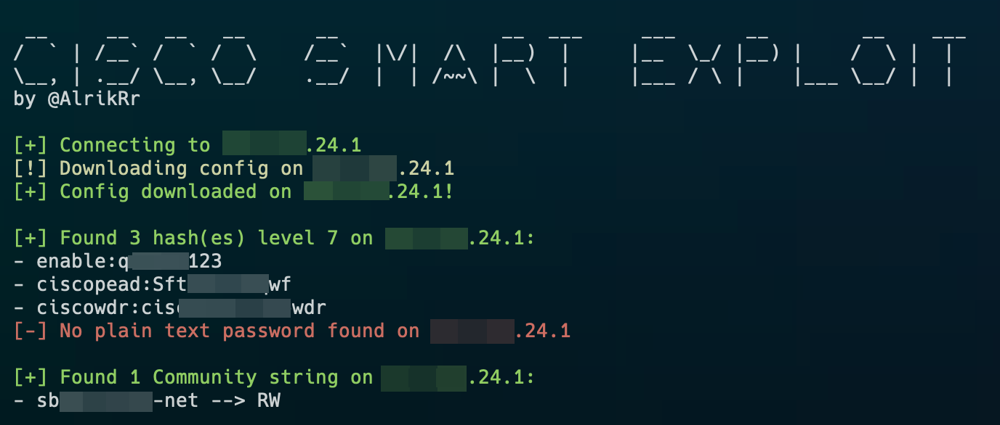

# Cisco-Smart-Exploit
Cisco SmartInstall Exploit **CVE-2018-0171**

> Inspired from [C. Papathanasiou PoC](https://github.com/ChristianPapathanasiou/CiscoSmartInstallExploit)

This Python 3 script uses port 4786 on a Cisco device running SmartInstall to exploit **CVE-2018-0171**. With the use of this exploit, an attacker can craft a payload, send it to the Cisco device, and then extract the contents of the `running-config` file.

The Cisco Smart Exploit script can:  
- **Extract** the running-config file
- **Parse** and **decrypt** secret 7 hashes
- **Parse** plain text passwords
- **Parse** all the **Community String**



## Requirements

Here is the list of requirements to use the script:

- `tftpy==0.8.2`
- `c7decrypt` for secret 7 decryption
    - `gem install c7decrypt`

## Usage

```bash
 __     __   __   __      __              __  ___     ___      __        __    ___
/  ` | /__` /  ` /  \    /__`  |\/|  /\  |__)  |     |__  \_/ |__) |    /  \ |  |
\__, | .__/ \__, \__/    .__/  |  | /~~\ |  \  |     |___ / \ |    |___ \__/ |  |
by @AlrikRr

usage: cisco-se.py [-h] (-i IP | -f FILE | -c CONFIG)

optional arguments:
  -h, --help  show this help message and exit
  -i IP       Single IP Address
  -f FILE     File that contains IP list
  -c CONFIG   running-config File standalone
```
Examples :
```bash
python3 cisco-se.py -i 192.168.10.1

python3 cisco-se.py -f ip_list.txt

python3 cisco-se.py -c running-config.txt
```

### Nmap Output IP list

For the `-f FILE` option, here is an example using nmap:  

```bash
nmap -p 4786 10.20.30.0/24 --open -Pn -oG - | awk '/Up$/{print $2}' > ip_list.txt
```

## Todo List
- [ ] Handle the timeout error for some ips during `client.download()`
